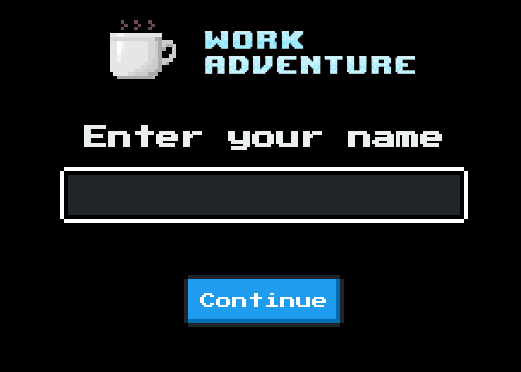
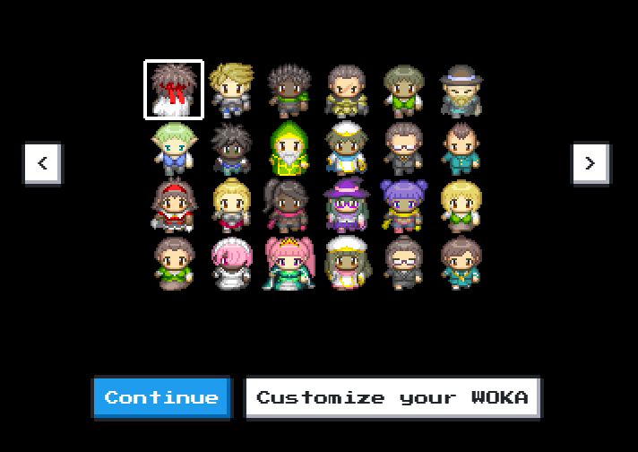
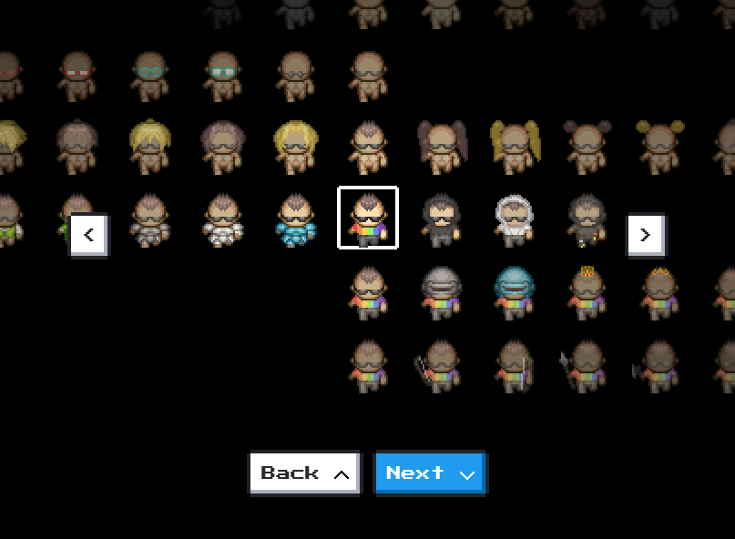
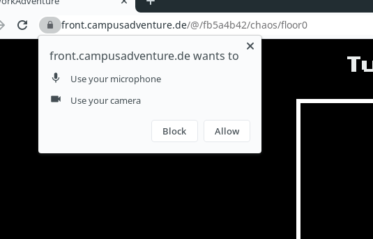
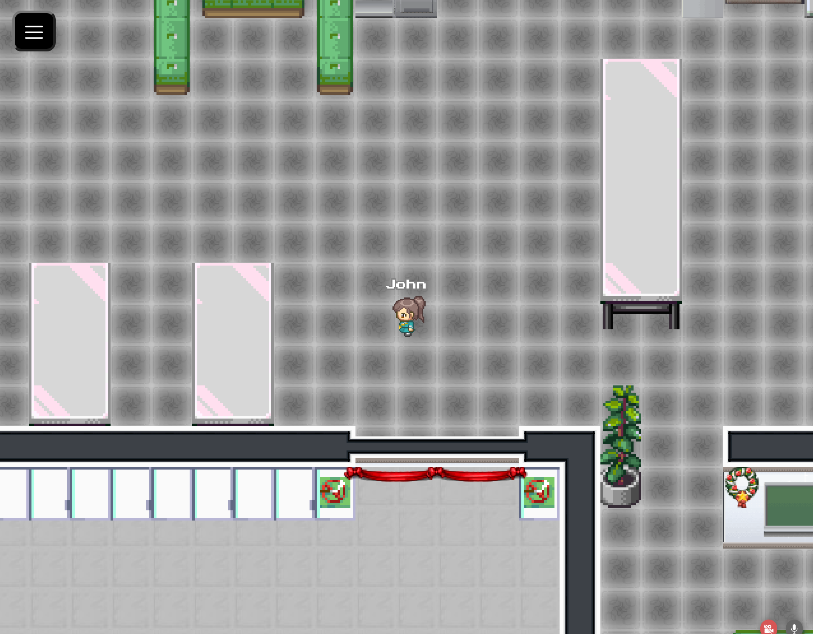
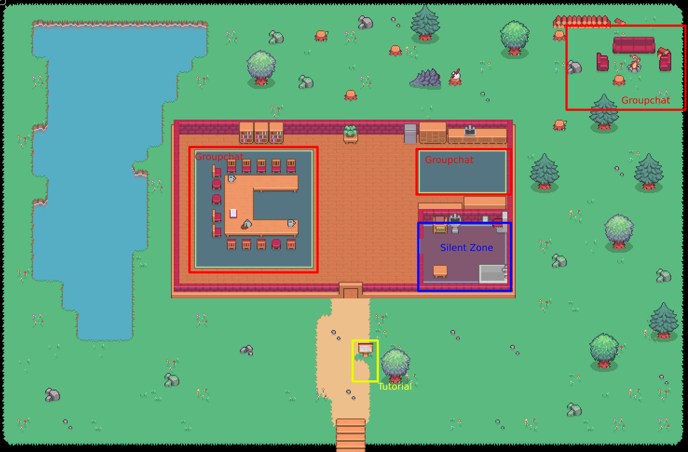

# Workadventure User Guide

This document will guide you through the basic steps to login and participate.

## Prerequisites

There are many browsers that may also work perfectly fine
but for the best experience use one of the following browser on your desktop pc:

* [Chrome](https://www.google.com/chrome/)
* [Firefox](https://www.mozilla.org/en-US/firefox/new/)

**Please use Chrome at the moment**

## Login

You can either login via the [hub](hub.md) or with an invite link.
An invite link will look like this:

```
https://front.campusadventure.de/register/<A lot of random text>
```

### Setting your name



The first thing that will be asked of you is to input a username.
This should be your name or a name your colleges can relate to you.

### Choosing your avatar



There are some preconfigured characters you can choose from. If you like one select it with your mouse, press `Continue` and skip the next step.

If you want your avatar to be a bit more unique or the medival vibe is just not yours, you can customize your avatar by pressing `Customize your avatar`.

### Customizing your Avatar



In this screen you can assemble yourself a new avatar.
To navigate you can use your arrow keys. With left and right you can choose the variant of an accessory, 
with up and down which accessory to modify. When you are in the last row the `Next` button will change to `Finish`.
Press it and continue with the next step.

### Setting up camera and microphone

On this screen you will be greeted by a popup from your browser asking for permissions to use your camera and microphone. For some users this can take a few seconds, but not longer than half a minute. It may not look exactly like the image since this will differ between browsers.



Press `Allow`

With that done you should see the picture of your camera where the crossed out logo of a webcam was. If you have multiple cameras connected you can use the dropdown menu below this box to switch between them.

At the same time you can check if your microphone is working. Below where your camera picture is you can see a bar that indicates if your microphone is picking up any sound. You should see movement when you speak in your microphone or clap in front of it.


If not, check if you have the right microphone selected, you can change it like you the camera, in the dropdown menu below your cameras image.

Now you can join up with the others by pressing the big blue button labled `Let's go!`

## The Space



Congratulations, you made it into space! Well, a space. Here you can meet other people, have a chat, or discuss something that interests you.

### Movement

To move through the world you can use your arrow keys or the `W` `A` `S` `D` keys.
Just press the direction you want to walk in.

If you want to move a bit faster you can simultaneously press your `Shift` key.

### Small Group Chat (up to 4)

If you want to talk to someone just walk up to them.
When you are standing close enough a small popup will open in the upper right corner of your browser where you can see
and talk with the person you went up to. You can stand together in a group up to 4 People.

### Big Group Chat

You have to go to one of the rooms scattered around the map. Not all of them work are hooked up
but most of them should be. If you are in such a room, a panel will open from the right of the
browser that loads a group video call. If you want to leave that call just walk out of the room.

### The Map

The map is composed of a central house and a lot of space around it.
In the areas marked red you can have a conversation with a bigger group, just walk into it.

The blue zone marked `Silent Zone` surpresses any kind of communication, you can go there if you want
to work alone or just have to go to the toilet.

The yellow zone marked `Tutorial` opens this website as a sidepanel.


